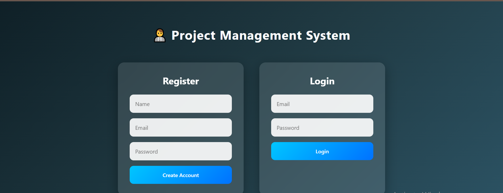
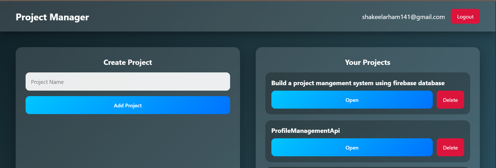
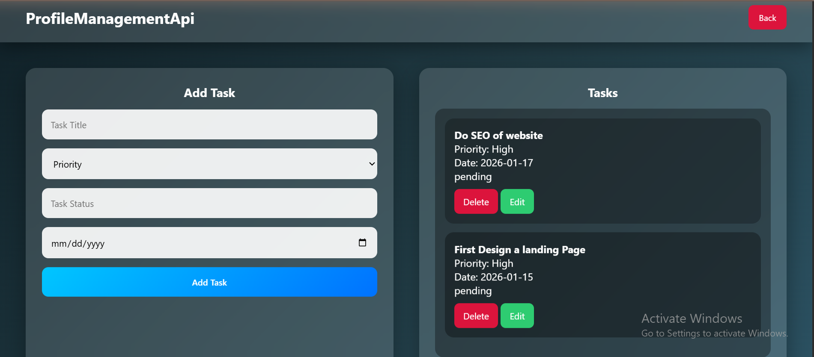

# Project Management System 🚀

A modern **Project Management System** built using **HTML, CSS, JavaScript & Firebase**.  
Users can create projects, manage tasks, and track progress securely.

## 🔥 Features
- User Authentication (Firebase Auth)
- Create & delete projects
- Add, edit & delete tasks
- Project-wise task management
- Real-time data sync (Firestore)
- Responsive modern UI
- Secure user-based data access

## 🛠️ Tech Stack
- HTML5
- CSS3 (Modern UI + Animations)
- JavaScript (ES6)
- Firebase Authentication
- Firebase Firestore

## 📸 Screenshots

### 🔐 Authentication

### 📊 Dashboard

### ✅ Project Tasks

## 🌐 Live Demo
(https://project-management-system12.netlify.app/)

## 👨‍💻 Author
**Arham Ahmed**  
Frontend Developer (Firebase + JS)

---
